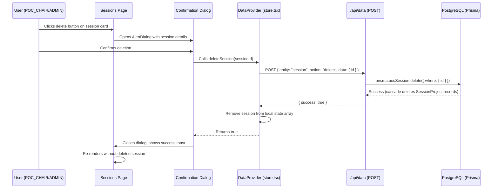

# Design Document: Session Delete

## Overview

This feature adds the ability to permanently delete POC Sessions from the sessions list page. It integrates with the existing authorization system (`lib/rules.ts`), the data API (`/api/data`), and the client-side state management (`lib/store.tsx`) to provide a complete delete workflow with confirmation, permission checks, cascade deletion, and immediate UI feedback.

The design follows existing patterns established by other entity mutations in the codebase (e.g., `addSession`, `updateSession`, `deleteUser`) and leverages the existing `AlertDialog` component from Radix UI for the confirmation modal.

## Architecture



## Components and Interfaces

### 1. Authorization Extension (`lib/rules.ts`)

Add `DELETE_SESSION` to the `canPerformAction` function's action union type. The permission is granted to `POC_CHAIR` and `ADMIN` roles, mirroring the existing `CREATE_SESSION` permission.

```typescript
// Added to the action union type in canPerformAction
| "DELETE_SESSION"

// Implementation within the switch:
case "DELETE_SESSION":
  return user.role === "POC_CHAIR" || user.role === "ADMIN"
```

### 2. DataProvider Extension (`lib/store.tsx`)

Add a `deleteSession` function to the `DataContextType` interface and implementation:

```typescript
interface DataContextType {
  // ... existing members
  deleteSession: (id: string) => Promise<boolean>
}
```

The function:
1. Calls the data API with `{ entity: "session", action: "delete", data: { id } }`
2. On success (HTTP 200): removes the session from local `sessions` state and returns `true`
3. On failure: leaves the `sessions` array unchanged and returns `false`

### 3. API Route Extension (`app/api/data/route.ts`)

Add a `"delete"` case to the `VALID_ACTIONS` array and handle the `session` + `delete` combination:

```typescript
// Add "delete" to VALID_ACTIONS
const VALID_ACTIONS = ["insert", "update", "upsert", "delete"] as const

// In the session entity handler:
case "session": {
  if (action === "delete") {
    const existing = await prisma.pocSession.findUnique({ where: { id: data.id } })
    if (!existing) {
      return NextResponse.json({ error: "Session not found" }, { status: 404 })
    }
    await prisma.pocSession.delete({ where: { id: data.id } })
  }
  // ... existing insert/update cases
}
```

### 4. Delete Confirmation Dialog Component

A new component `components/sessions/delete-session-dialog.tsx` using the existing `AlertDialog` from `@radix-ui/react-alert-dialog` (already in the project as `components/ui/alert-dialog.tsx`):

```typescript
interface DeleteSessionDialogProps {
  session: POCSession
  open: boolean
  onOpenChange: (open: boolean) => void
}
```

The dialog:
- Displays the committee type label and formatted date to identify the session
- Shows a permanent deletion warning
- Has Cancel and Delete buttons
- Disables both buttons while the delete request is in-flight
- Calls `deleteSession` from `DataProvider` on confirm
- Shows a success or error toast via `sonner`

### 5. Sessions Page Integration (`app/(dashboard)/sessions/page.tsx`)

- Adds a delete button (Trash2 icon) to each session card, visible only when `canPerformAction(currentUser, "DELETE_SESSION")` returns `true`
- The button includes an `aria-label` such as `"Delete {committeeType} session on {date}"`
- Clicking the button opens the `DeleteSessionDialog` for that session

## Data Models

### Existing Models (No Changes Required)

The Prisma schema already supports cascade deletion:

```prisma
model SessionProject {
  session PocSession @relation(fields: [sessionId], references: [id], onDelete: Cascade)
}
```

When a `PocSession` is deleted, all related `SessionProject` records are automatically cascade-deleted by PostgreSQL.

### API Request/Response Shapes

**Delete Request:**
```json
{
  "entity": "session",
  "action": "delete",
  "data": { "id": "ses-101" }
}
```

**Success Response (200):**
```json
{ "success": true }
```

**Not Found Response (404):**
```json
{ "error": "Session not found" }
```

**Validation Error Response (400):**
```json
{ "error": "Missing required fields", "details": ["data.id is required"] }
```

**Auth Error Response (401):**
```json
{ "error": "Unauthorized" }
```

## Correctness Properties

*A property is a characteristic or behavior that should hold true across all valid executions of a system — essentially, a formal statement about what the system should do. Properties serve as the bridge between human-readable specifications and machine-verifiable correctness guarantees.*

### Property 1: DELETE_SESSION permission is role-exclusive

*For any* user, `canPerformAction(user, "DELETE_SESSION")` returns `true` if and only if the user's role is `POC_CHAIR` or `ADMIN`. For all other roles (`PM`, `POC_MEMBER`), it returns `false`.

**Validates: Requirements 1.1, 1.2, 1.3, 5.1**

### Property 2: Successful deletion removes session from state

*For any* sessions array and any session ID present in that array, if the API returns a success response, calling `deleteSession(id)` removes exactly that session from the array (the resulting array has length one less and does not contain a session with that ID) and returns `true`.

**Validates: Requirements 4.1, 5.2**

### Property 3: Failed deletion preserves state

*For any* sessions array and any session ID, if the API returns a failure response (network error or non-200 status), calling `deleteSession(id)` leaves the sessions array unchanged (deep equality with the original) and returns `false`.

**Validates: Requirements 4.3, 5.3**

## Error Handling

| Scenario | Behavior |
|----------|----------|
| Network error during delete | Error toast displayed, dialog closes, sessions array unchanged |
| API returns 404 (session not found) | Error toast with "session not found" message, dialog closes |
| API returns 401 (unauthorized) | Error toast, dialog closes — user may be redirected to login |
| API returns 400 (missing ID) | Should not occur if client code is correct; defensive error toast |
| API returns 500 (server error) | Generic error toast "Deletion unsuccessful", dialog closes |
| User double-clicks confirm | Buttons disabled during in-flight request, preventing duplicate calls |
| Dialog dismissed via Escape | Dialog closes, no API call made, session unchanged |

## Testing Strategy

### Property-Based Tests (using `fast-check` + `vitest`)

The project already has `fast-check` (v4.8.0) and `vitest` (v4.1.9) configured. Each correctness property maps to one property-based test with a minimum of 100 iterations.

| Property | Test Description | Tag |
|----------|-----------------|-----|
| Property 1 | Generate random users with all possible roles, verify DELETE_SESSION permission matches role | `Feature: session-delete, Property 1: DELETE_SESSION permission is role-exclusive` |
| Property 2 | Generate random sessions arrays and pick a random session ID, mock successful API, verify removal | `Feature: session-delete, Property 2: Successful deletion removes session from state` |
| Property 3 | Generate random sessions arrays, mock failed API responses, verify array is unchanged | `Feature: session-delete, Property 3: Failed deletion preserves state` |

### Unit Tests (example-based)

- Confirmation dialog renders with correct session identification (committee type + date)
- Delete button has accessible `aria-label` with session context
- Buttons are disabled while delete is in-flight
- Dialog closes on cancel/escape without triggering deletion
- Success toast appears after successful deletion
- Error toast appears after failed deletion

### Integration Tests

- API route handles `action: "delete"` for session entity and returns 200
- API route returns 404 for non-existent session ID
- API route returns 400 when `data.id` is missing
- Cascade deletion removes related `SessionProject` records
- Auth middleware rejects requests without valid JWT
